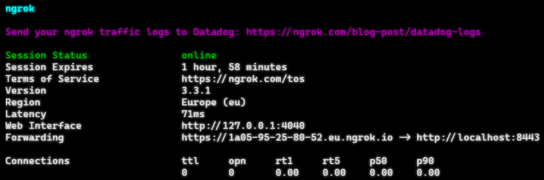
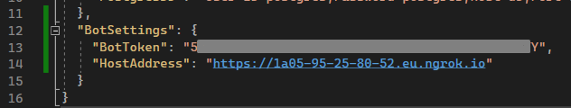

# Introduction

This is my own development, many technologies that I had to deal with in my work are concentrated in this repository. All this is designed in the form of a telegram bot for convenience and visual demonstration.
 
# Core

Here will be a description of root services, adapters and controllers

### Docker

### Stand container logs

~~Available via http://heppymonbot.ru:8888/~~

~~TODO: Fix nginx routing for https://heppymonbot.ru/logs instead of simple http with 8888 container direct port.~~

Stand info:

new ip - 80.87.104.208 (my own VDS on netangels created by user: u108763)

new domain - https://myzdrikov.ru/

# Architecture

There will be a link to miro with a ready-made architecture when the project is at the "visualization required" stage. Until then, I do not see the point in preparing a scheme, since I do not know in advance with which libraries and in what form it will work.

# Usings

Documentation on the use of the bot in telegram, as well as integration with API

## Ngrok

[Download here!](https://dashboard.ngrok.com/get-started/setup)

It is needed for debugging the backend. Telegram does not allow you to send hook requests to an address without https. Ngrok copes with this task wonderfully.

### Usage

Run on any cmd (where ngrok.exe is located):

```
.\ngrok.exe http 8443
```

Out:



Now all requests for `https://1a05-95-25-80-52.eu.ngrok.io`

Will be redirected directly to your local address `http://localhost:8443`

Now it remains to copy the path obtained from NGROK to the local appsettings.Local.json config



# Used libraries

List of used libraries with possible notes by version
